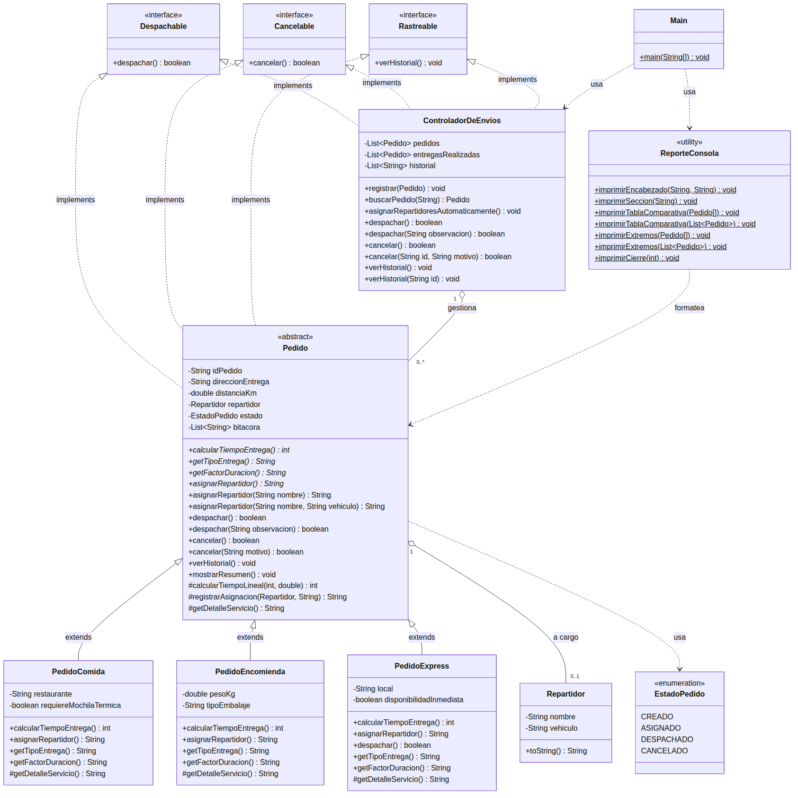

# SpeedFast — Sistema de reparto

**Asignatura:** Desarrollo Orientado a Objetos II (PRY2203)
**Experiencia 1 — Semana 3:** Diseñando un sistema orientado a objetos con clases abstractas, polimorfismo e interfaces

## Descripción

Sistema de consola para **SpeedFast**, empresa de reparto a domicilio con tres tipos de servicio:
comida (restaurantes), encomiendas (documentos o paquetes) y compras express (supermercado o farmacia).

Esta versión integra los tres pilares pedidos en la actividad:

- **Abstracción** — `Pedido` es una clase abstracta: implementa una vez lo que es común
  (`mostrarResumen()`, `calcularTiempoLineal()`, despacho, cancelación y bitácora) y declara
  abstracto lo que cambia según el tipo de servicio.
- **Polimorfismo** — cada subclase **sobrescribe** `calcularTiempoEntrega()` y `asignarRepartidor()`;
  además `asignarRepartidor` está **sobrecargado** para permitir la asignación manual del operador.
- **Interfaces** — `Despachable`, `Cancelable` y `Rastreable` separan las operaciones funcionales
  del modelo de datos, y son implementadas por dos clases sin relación de herencia entre sí:
  `Pedido` y `ControladorDeEnvios`.

## Estructura del proyecto

```
semana 3/
├── src/
│   └── com/speedfast/
│       ├── Main.java                       Simulación del sistema
│       ├── contrato/
│       │   ├── Despachable.java            Interfaz — despachar()
│       │   ├── Cancelable.java             Interfaz — cancelar()
│       │   └── Rastreable.java             Interfaz — verHistorial()
│       ├── modelo/
│       │   ├── Pedido.java                 Clase ABSTRACTA base
│       │   ├── PedidoComida.java           Subclase — 15 min + 2 min/km
│       │   ├── PedidoEncomienda.java       Subclase — 20 min + 1,5 min/km
│       │   ├── PedidoExpress.java          Subclase — 10 min, +5 min sobre 5 km
│       │   ├── Repartidor.java             Persona que realiza la entrega
│       │   └── EstadoPedido.java           Enum — RESERVADO / ASIGNADO / DESPACHADO / CANCELADO
│       ├── servicio/
│       │   └── ControladorDeEnvios.java    Coordina la jornada (ArrayList de pedidos e historial)
│       └── reporte/
│           └── ReporteConsola.java         Formato de la salida por consola
├── docs/
│   ├── diagrama-clases-speedfast.png       Diagrama de clases UML
│   └── diagrama-clases-speedfast.mmd       Fuente editable del diagrama
└── README.md
```

## Diagrama de clases



```
                      Despachable      Cancelable      Rastreable
                      despachar()      cancelar()      verHistorial()
                           ▲                ▲                ▲
              ┌────────────┴────────────────┴────────────────┴────────────┐
              │                                                           │
        Pedido (abstracta)                                    ControladorDeEnvios
   idPedido, direccionEntrega, distanciaKm                  List<Pedido> pedidos
   repartidor, estado, bitácora                             List<Pedido> entregasRealizadas
   mostrarResumen()        <- implementado                  List<String> historial
   calcularTiempoLineal()  <- implementado
   calcularTiempoEntrega() <- ABSTRACTO
   asignarRepartidor()     <- ABSTRACTO
              ▲
   ┌──────────┼───────────────────┐
PedidoComida  PedidoEncomienda  PedidoExpress
```

## Ciclo de vida de un pedido

```
RESERVADO ──asignarRepartidor()──▶ ASIGNADO ──despachar()──▶ DESPACHADO
    │                                  │
    └──────────cancelar()──────────────┴──▶ CANCELADO
```

Un pedido reservado todavía no tiene repartidor. Solo se despacha lo que está asignado, y solo se
cancela lo que aún no salió a ruta.

## Reglas de negocio por tipo de pedido

| Tipo | Tiempo de entrega | Criterio de asignación automática |
|------|-------------------|-----------------------------------|
| Comida | 15 min de cocina + 2 min/km | Repartidor con mochila térmica si el pedido debe llegar caliente |
| Encomienda | 20 min de retiro + 1,5 min/km | Furgón de carga si el paquete supera los 20 kg; moto en caso contrario |
| Compra Express | 10 min fijos, +5 min si supera los 5 km | Solo se asigna si hay repartidor cercano libre; si no, queda en espera |

`PedidoExpress` además **sobrescribe `despachar()`** para marcarse como prioritario, reutilizando
con `super.despachar()` toda la validación de la clase base en lugar de repetirla.

## Polimorfismo aplicado

**Sobrescritura (mismo método, distinta implementación por subclase):**

- `calcularTiempoEntrega()` en las tres subclases.
- `asignarRepartidor()` en las tres subclases.
- `despachar()` en `PedidoExpress`.
- `getTipoEntrega()`, `getFactorDuracion()` y `getDetalleServicio()` en las tres subclases.

**Sobrecarga (mismo nombre, distinta lista de parámetros):**

- `asignarRepartidor()` / `asignarRepartidor(String nombre)` / `asignarRepartidor(String nombre, String vehiculo)`
- `despachar()` / `despachar(String observacion)`
- `cancelar()` / `cancelar(String motivo)` en `Pedido`, y `cancelar()` / `cancelar(String id, String motivo)` en `ControladorDeEnvios`
- `verHistorial()` / `verHistorial(String idPedido)` en `ControladorDeEnvios`
- `imprimirTablaComparativa()` e `imprimirExtremos()` en `ReporteConsola`, para arreglo y para `List`

## Interfaces y desacoplamiento

Las tres interfaces se declararon por separado a propósito: una clase puede necesitar despacharse
sin poder cancelarse, así que agruparlas en un solo contrato obligaría a implementar comportamiento
que no corresponde.

Cada interfaz es implementada por **dos clases distintas** con alcances diferentes:

| Interfaz | En `Pedido` | En `ControladorDeEnvios` |
|----------|-------------|--------------------------|
| `Despachable` | pone ese pedido en ruta | despacha el lote completo de la jornada |
| `Cancelable` | anula ese pedido | cancela los pedidos que aún no salieron |
| `Rastreable` | bitácora del propio pedido | historial global de la operación |

Gracias a esto, en `Main` un mismo arreglo `Rastreable[]` guarda un `Pedido` y el
`ControladorDeEnvios` —clases sin herencia común— y ambos se recorren igual.

## Escalabilidad, reutilización y mantenibilidad

**Escalabilidad — agregar un tipo de pedido no obliga a tocar lo que ya funciona.**
Para incorporar, por ejemplo, un `PedidoFarmacia` con receta médica basta con crear la subclase y
escribir sus dos métodos propios: `calcularTiempoEntrega()` y `asignarRepartidor()`. Ni `Main`, ni
`ControladorDeEnvios`, ni `ReporteConsola` cambian una sola línea, porque todos trabajan con
referencias de tipo `Pedido` y es Java, en tiempo de ejecución, quien resuelve la versión correcta.
Lo mismo ocurre con las interfaces: si mañana un almacén también debe ser despachable, implementa
`Despachable` y entra al sistema sin heredar de nadie.

**Reutilización — lo común se escribe una vez.**
Los seis atributos y la lógica compartida viven en la clase abstracta: `calcularTiempoLineal()` lo
usan comida y encomienda con parámetros distintos; `registrarAsignacion()` lo usan las tres formas
de asignar repartidor; `despachar()`, `cancelar()` y `verHistorial()` se implementan una vez y
sirven para las tres subclases. `PedidoExpress` necesita despachar distinto y aun así reutiliza la
validación de la base llamando a `super.despachar()` antes de agregar lo suyo.

**Mantenibilidad — cada cambio tiene un solo lugar donde hacerse.**
Si cambia el formato del reporte se toca `ReporteConsola`; si cambia una fórmula de tiempo se toca
esa subclase; si cambian las reglas de la jornada se toca `ControladorDeEnvios`. `Main` no contiene
reglas de negocio, así que leerlo alcanza para entender el flujo sin entrar en los detalles. Los
estados están en un `enum` y no en cadenas de texto, de modo que un estado mal escrito lo detecta
el compilador y no el usuario. Y la bitácora registra también las operaciones rechazadas, lo que
permite reconstruir qué pasó sin depender de la memoria de quien operó el sistema.

## Reglas de estado

El pedido no permite cualquier operación en cualquier momento:

- No se despacha un pedido sin repartidor asignado.
- No se despacha un pedido cancelado.
- No se cancela un pedido que ya va en ruta.
- No se asigna repartidor a un pedido cancelado.
- No se reserva dos veces el mismo pedido.

Cada intento rechazado queda registrado en la bitácora, de modo que el historial explica no solo
lo que ocurrió sino también lo que se intentó.

## Cómo ejecutar

Desde IntelliJ IDEA: abrir la carpeta `semana 3` y ejecutar `Main`.

Desde la terminal:

```bash
cd "semana 3"
javac -encoding UTF-8 -d out $(find src -name "*.java")
java -cp out com.speedfast.Main
```

## Salida por consola

La simulación recorre en orden: reserva de los pedidos, asignación automática, asignación manual,
tiempos estimados, detalle de cada pedido, cancelación de un envío, despacho del lote, intento de
cancelar un pedido ya en ruta, e historial (global y por pedido).

```
============================================================
  SISTEMA DE REPARTO SPEEDFAST - Semana 3
  Polimorfismo, clase abstracta e interfaces en operacion
============================================================

1. RESERVA DE PEDIDOS

   P-001    Comida           reservado para Av. Providencia 1234, Santiago
   P-002    Encomienda       reservado para Calle Los Aromos 456, Maipu
   P-003    Compra Express   reservado para Pasaje El Roble 789, La Florida
   P-004    Compra Express   reservado para Av. Vicuna Mackenna 1500, Nunoa

2. ASIGNACION AUTOMATICA DE REPARTIDORES

   P-001 -> Camila Soto (moto con mochila termica) - el pedido debe llegar caliente
   P-002 -> Marcela Rojas (furgon de carga) - el paquete supera los 20.0 kg de la moto
   P-003 -> Valentina Cortes (bicicleta electrica) - repartidor cercano disponible de inmediato
   P-004 -> Sin disponibilidad inmediata: el pedido queda en espera.

3. ASIGNACION MANUAL DEL OPERADOR

   P-004 quedo sin repartidor automatico, se asigna a mano:
   -> Rodrigo Lagos (moto) - asignacion manual del operador con vehiculo indicado
   El restaurante pide un repartidor conocido para P-001:
   -> Fernanda Vidal (vehiculo por confirmar) - asignacion manual del operador

4. TIEMPO ESTIMADO DE ENTREGA POR TIPO

PEDIDO   TIPO              DISTANCIA     TIEMPO
------------------------------------------------
P-001    Comida               3.5 km     22 min
P-002    Encomienda           8.0 km     32 min
P-003    Compra Express       2.0 km     10 min
P-004    Compra Express       7.5 km     15 min

...

6. CANCELACION DE UN ENVIO

   P-002 cancelado. Motivo: el cliente ya no se encuentra en el domicilio

7. DESPACHO DEL LOTE

   P-001 en ruta con Fernanda Vidal (vehiculo por confirmar)
   P-002 no se despacha (Cancelado)
   P-003 en ruta con Valentina Cortes (bicicleta electrica)
   P-004 en ruta con Rodrigo Lagos (moto)

8. INTENTO DE CANCELAR UN PEDIDO EN RUTA

   P-003 no se puede cancelar (En ruta)

9. HISTORIAL DE ENTREGAS

Entregas despachadas: 3
   - P-001 | Comida | Fernanda Vidal (vehiculo por confirmar) | 22 min
   - P-003 | Compra Express | Valentina Cortes (bicicleta electrica) | 10 min
   - P-004 | Compra Express | Rodrigo Lagos (moto) | 15 min
```

## Decisiones de diseño

- **`Repartidor` como clase y no como `String`.** Un repartidor tiene nombre y vehículo, y podría
  crecer más adelante sin obligar a tocar la jerarquía de pedidos.
- **`EstadoPedido` como `enum`.** El conjunto de estados es cerrado y conocido: el compilador impide
  escribir un estado que no existe y las comparaciones no dependen de cómo se escriba la palabra.
- **`registrarAsignacion()` protegido en la clase base.** Las tres formas de asignar repartidor
  (una automática y dos manuales) comparten exactamente el mismo efecto sin repetir código.
- **`registrarEvento()` declarado `final`.** El constructor de `Pedido` ya lo usa; si una subclase
  pudiera sobrescribirlo, estaría anotando eventos sobre un objeto todavía a medio construir.
- **`ReporteConsola` separada del modelo.** Las clases de negocio calculan y devuelven datos; el
  formato de la salida vive en un solo lugar y se cambia sin tocar la lógica.
- **`Main` sin reglas de negocio.** Solo arma el escenario y pide operaciones: quién decide es la
  subclase correspondiente o el controlador.

---

**Autora:** Olga Rivas
