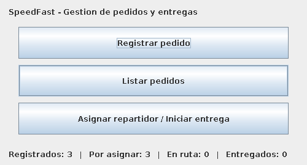
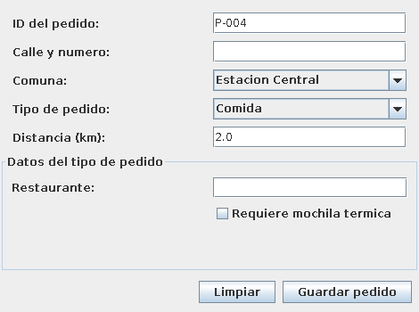
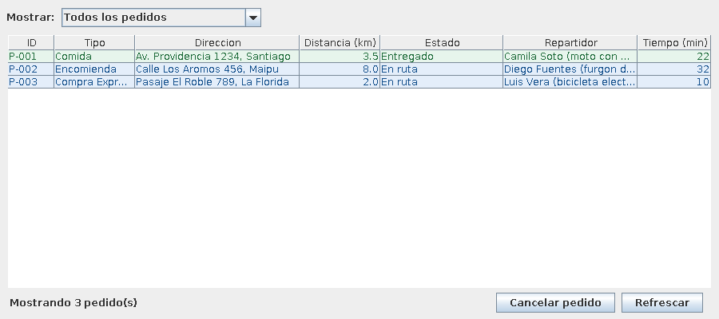
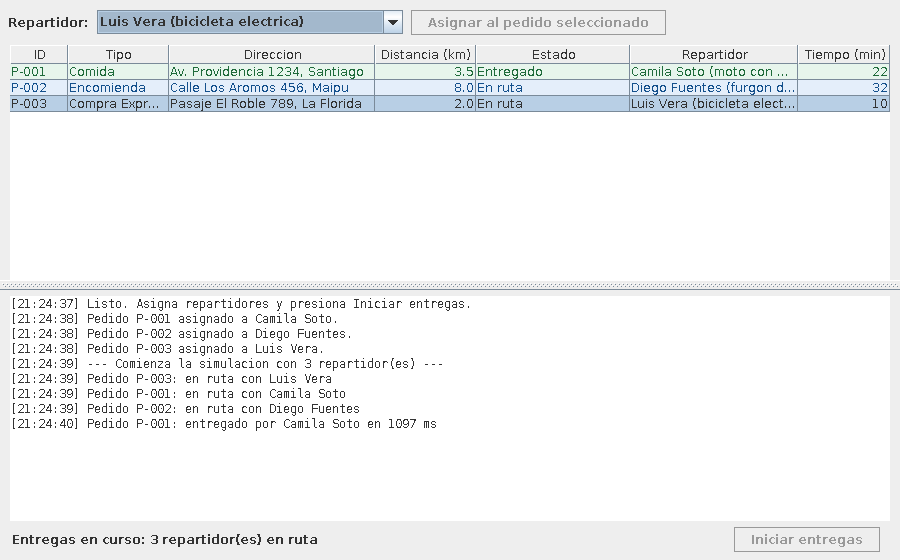

# SpeedFast — Interfaz gráfica de escritorio

**Asignatura:** Desarrollo Orientado a Objetos II (PRY2203) — Duoc UC
**Experiencia 2 — Semana 6:** Diseñando interfaces gráficas para aplicaciones en Java

## Descripción

Sexta etapa del sistema de SpeedFast. Las semanas anteriores dejaron el modelo de pedidos y la
ejecución concurrente de entregas; esta semana todo eso se maneja desde una **interfaz gráfica de
escritorio hecha con Java Swing**, en lugar de la consola.

La aplicación permite registrar pedidos con un formulario, verlos en una tabla que se mantiene al
día, asignarles repartidor y lanzar la simulación de entregas viendo el avance en pantalla.

## Estructura del proyecto

```
semana 6/
├── docs/capturas/                   Capturas de las ventanas
├── src/com/speedfast/
│   ├── main/
│   │   └── Main.java                Punto de entrada: abre VentanaPrincipal
│   ├── vista/
│   │   ├── VentanaPrincipal.java    Menú con los tres botones
│   │   ├── VentanaRegistroPedido.java   Formulario de registro
│   │   ├── VentanaListaPedidos.java     Tabla de pedidos
│   │   ├── VentanaEntregas.java     Asignación y simulación
│   │   ├── ModeloTablaPedidos.java  DefaultTableModel de las tablas
│   │   └── RenderEstadoPedido.java  Pinta cada fila según el estado
│   ├── control/
│   │   └── ControladorDePedidos.java    Listas en memoria y operaciones
│   ├── modelo/                      Reutilizado de las semanas 2 a 5
│   │   ├── Pedido.java              Clase abstracta
│   │   ├── PedidoComida.java
│   │   ├── PedidoEncomienda.java
│   │   ├── PedidoExpress.java
│   │   ├── EstadoPedido.java
│   │   ├── Comuna.java              Comunas y su distancia aproximada
│   │   └── Repartidor.java          Runnable, ahora informa a la interfaz
│   └── contrato/
│       ├── Despachable.java
│       ├── Cancelable.java
│       ├── Rastreable.java
│       └── EscuchaDeEntregas.java   Contrato entre el modelo y la ventana
├── test/com/speedfast/
│   ├── control/
│   │   └── ControladorDePedidosTest.java   Pruebas del controlador
│   └── vista/
│       └── ModeloTablaPedidosTest.java     Pruebas del modelo de la tabla
├── semana 6.iml
└── README.md
```

Los paquetes `modelo`, `vista` y `main` son los que pide la actividad. `control` y `contrato`
separan lo que no es ni modelo ni pantalla: los datos compartidos y las interfaces.

## Las ventanas

| Ventana | Qué hace |
|---------|----------|
| `VentanaPrincipal` | `BorderLayout`: el título arriba, los tres botones al centro en un `GridLayout`, y abajo un resumen que se actualiza solo (registrados, por asignar, en ruta, entregados) |
| `VentanaRegistroPedido` | Formulario con ID, calle, comuna (`JComboBox`), tipo (`JComboBox`) y distancia. Según el tipo, un `CardLayout` muestra los campos propios: restaurante, peso y embalaje, o local |
| `VentanaListaPedidos` | `JTable` alimentada por `ModeloTablaPedidos` (extiende `DefaultTableModel`), con filtro por estado, orden por columna, cancelación de pedidos, botón de refrescar y contador |
| `VentanaEntregas` | Tabla de pedidos, combo de repartidores, botón para asignar y botón para iniciar la simulación, más un registro de avance con la hora de cada evento |

### Navegación

Las tres ventanas se abren desde `VentanaPrincipal` y comparten el mismo `ControladorDePedidos`,
así que trabajan siempre sobre los mismos datos. Cada una se crea una sola vez: al cerrarla se
oculta (`HIDE_ON_CLOSE`) en lugar de destruirse, de modo que conserva su contenido, no queda
registrada dos veces como observadora y una simulación en curso no pierde la ventana que la
muestra.

### Validaciones del formulario

El campo ID llega **prellenado con el siguiente identificador libre** (`P-004`, `P-005`…), que
`ControladorDePedidos.sugerirIdPedido()` calcula a partir del mayor número ya usado. Sigue siendo
editable, así que la validación continúa aplicándose: antes de guardar se comprueba que el ID no
esté vacío, no lleve espacios y no esté repetido; que haya calle y comuna; que la distancia sea un
número **finito**, no negativo y dentro de un máximo razonable —`Double.parseDouble` acepta también
`Infinity` y `NaN`, que dejarían la tabla con tiempos absurdos, así que se descartan con
`Double.isFinite()`—, y los campos propios del tipo: restaurante obligatorio, peso
mayor que cero y embalaje obligatorio, o local obligatorio. Cada error se muestra con un
`JOptionPane` y deja el foco en el campo que hay que corregir. Solo si todo está correcto se crea
el pedido, se agrega a la lista y aparece la confirmación.

### La tabla: color, orden y filtro

Cada fila se pinta según el estado del pedido con `RenderEstadoPedido`, un `DefaultTableCellRenderer`:
verde los entregados, azul los que van en ruta, naranjo los asignados y rojo los cancelados. El
render consulta el estado al modelo, no al texto de la celda, y convierte la fila con
`convertRowIndexToModel()` porque con la tabla ordenada la fila que se dibuja no es la misma que la
del modelo.

`setAutoCreateRowSorter(true)` permite ordenar haciendo clic en cualquier encabezado, y el combo
"Mostrar" filtra por estado. Por eso, en las ventanas donde se selecciona una fila, el pedido se
identifica por su ID y no por el número de fila.

Para que ese orden sea correcto, la distancia y el tiempo se guardan en la tabla como **números** y
no como texto, y `ModeloTablaPedidos` lo declara sobrescribiendo `getColumnClass()`. La unidad va en
el título de la columna (`Distancia (km)`, `Tiempo (min)`). Si se guardaran como texto, el orden
sería alfabético: `12.5` quedaría antes que `3.5`, y `10 min` antes que `9 min`.

### Los datos que el sistema propone

Dos campos del formulario eran datos que la usuaria tenía que inventar, y los dos se resolvieron
igual: proponiendo un valor razonable que igual se puede corregir.

- **El ID** llega prellenado con el siguiente identificador libre.
- **La distancia** se completa sola al elegir la comuna. El enum `Comuna` guarda, junto al nombre,
  una distancia aproximada desde la central de SpeedFast.

Sobre esas distancias, para ser claros: **son valores referenciales fijos**, no una medición. En un
sistema real vendrían de un servicio de geolocalización a partir de la dirección exacta. Lo que
cambia respecto a escribirlas a mano es que dejan de ser un número al azar y pasan a ser una
estimación consistente, y el campo sigue siendo editable para el caso en que el destino esté más
lejos de lo habitual dentro de la misma comuna.

La dirección se arma juntando las dos partes (`Av. Providencia 1234, Providencia`) y se guarda como
un solo String, así que el modelo de las semanas anteriores no cambia.

### Cancelar un pedido

El botón "Cancelar pedido" del listado usa la interfaz `Cancelable` que la jerarquía implementa
desde la semana 3. Pide confirmación con `showConfirmDialog` y el motivo con `showInputDialog`, y
después deja que decida el modelo: `Pedido.cancelar(motivo)` rechaza los pedidos que ya van en
ruta, y la ventana solo muestra el aviso. Si la cancelación procede, el controlador además saca el
pedido de la ruta del repartidor que lo tuviera asignado.

### La tabla se mantiene al día sola

`ControladorDePedidos` mantiene una lista de observadores. Cuando se registra un pedido o cambia
el estado de uno, avisa, y cada ventana vuelve a cargar lo que muestra. Por eso al guardar un
pedido la tabla ya lo tiene, sin apretar Refrescar.

## Interfaz y concurrencia

Los repartidores siguen siendo hilos, como en las semanas 4 y 5, pero ahora el avance se ve en la
ventana. Eso obliga a respetar la regla central de Swing: **los componentes solo se pueden tocar
desde el Event Dispatch Thread**, el hilo que dibuja la interfaz.

Cómo se resuelve aquí:

- `Repartidor` no sabe nada de Swing. Informa lo que va haciendo a través de la interfaz
  `EscuchaDeEntregas`, y quien la implementa decide cómo mostrarlo.
- Los métodos de `Pedido` que consultan o cambian el estado son **`synchronized`**, como el recurso
  compartido de la semana 5. Hacen falta porque dos hilos tocan el mismo pedido: el del repartidor
  lo despacha y lo entrega, y el gráfico puede cancelarlo desde el listado mientras tanto. Sin el
  candado, el repartidor puede comprobar que el pedido no está cancelado, cancelarse justo en ese
  instante, y despacharlo igual: quedaría un pedido "en ruta" sin repartidor, imposible de cancelar
  y que nunca llega a entregado.
- `VentanaEntregas` implementa esa interfaz. Como los avisos llegan desde los hilos de reparto,
  cada actualización se envía con `SwingUtilities.invokeLater(...)`, que la encola para el hilo
  gráfico.
- `ControladorDePedidos.iniciarEntregas(...)` lanza el `ExecutorService` y **vuelve de inmediato**.
  Si esperara a que terminen, el hilo gráfico quedaría bloqueado y la ventana se congelaría.
- `Main` crea la interfaz dentro de `SwingUtilities.invokeLater`, que es como corresponde iniciar
  una aplicación Swing.
- Al cerrar la ventana principal se llama a `detenerEntregas()`, para no dejar hilos vivos.

## Cómo ejecutar

**Desde IntelliJ IDEA:** abrir la carpeta `semana 6` y ejecutar `com.speedfast.main.Main`.

**Desde terminal:**

```bash
cd "semana 6"
javac -encoding UTF-8 -d out $(find src -name "*.java")
java -cp out com.speedfast.main.Main
```

La aplicación parte con tres pedidos de ejemplo cargados, para que la tabla no aparezca vacía.

## Pruebas unitarias

Como en la semana 5, lo que se puede comprobar solo se comprueba con pruebas, en vez de darlo por
hecho. Son **32 pruebas en dos archivos**, escritas con JUnit 5:

| Archivo | Qué comprueba |
|---------|---------------|
| `ControladorDePedidosTest` | Que no se acepten IDs repetidos ni pedidos nulos; que `sugerirIdPedido()` proponga el siguiente número libre incluso con IDs escritos a mano; que la búsqueda no distinga mayúsculas; que la lista entregada sea una copia; que asignar deje el pedido `ASIGNADO` y solo una vez; que cancelar funcione en `RESERVADO` y `ASIGNADO`, saque el pedido de la ruta del repartidor y **falle** si el pedido ya va en ruta; que los observadores reciban aviso de cada cambio |
| `ModeloTablaPedidosTest` | Que el modelo tenga las siete columnas; que `cargar()` deje una fila por pedido y en el mismo orden; que volver a cargar **reemplace** las filas en vez de acumularlas; que ninguna celda sea editable; que el modelo recuerde el ID y el estado de cada fila; que consultar una fila inexistente devuelva `null` en lugar de fallar; y que ordenar por distancia compare números y no texto |

Ninguna prueba abre una ventana. El controlador guarda los datos y `ModeloTablaPedidos` los ordena
en filas: ninguno de los dos necesita que haya pantalla, y por eso se pueden probar solos. Las
ventanas son las que no se prueban automáticamente, porque lo suyo es lo visual.

Para ejecutarlas desde IntelliJ: clic derecho sobre la carpeta `test` → *Run All Tests* (IntelliJ
ofrece descargar JUnit 5 la primera vez).

## Capturas

**Ventana principal**



**Registro de pedido** — los campos de abajo cambian según el tipo elegido



**Listado de pedidos** — con un pedido ya entregado en verde y dos en ruta en azul



**Entregas en curso** — los tres repartidores trabajando al mismo tiempo



## Decisiones de diseño

- **El combo de tipo decide la subclase.** Elegir "Comida", "Encomienda" o "Compra Express" crea
  un `PedidoComida`, `PedidoEncomienda` o `PedidoExpress`. La tabla muestra el tipo y el tiempo
  estimado sin preguntar de qué clase se trata: cada pedido responde con su propio cálculo.
- **Un solo controlador para las cuatro ventanas.** Es lo que evita tener copias distintas de la
  misma lista y lo que permite que todo se actualice junto.
- **El modelo no depende de Swing.** Si mañana la aplicación fuera web, `Pedido` y `Repartidor`
  seguirían sirviendo sin tocar una línea.
- **La interfaz usa el aspecto por defecto de Java.** No hay una clase de estilos ni colores
  propios: los componentes se ven como los dibuja el sistema. La claridad se consigue con la
  distribución (`BorderLayout`, `GridLayout`), los márgenes y los títulos de cada zona, no con
  decoración. El único color que se usa a propósito es el de la tabla, porque ahí sí comunica algo:
  el estado del pedido.
- **Las tablas no son editables.** `ModeloTablaPedidos` sobrescribe `isCellEditable()` para
  devolver siempre `false`: los datos se cambian con el formulario, no escribiendo sobre la celda.
- **El ID y la distancia los propone el sistema.** Eran los dos datos que había que inventar, y por
  eso los que más errores producían. Sugerirlos elimina el problema sin sacar los campos del
  formulario, así que la validación sigue teniendo sentido.

## Entorno

- IntelliJ IDEA
- Java 17
- Java Swing (incluido en el JDK, sin librerías externas)

---

**Autora:** Olga Rivas
