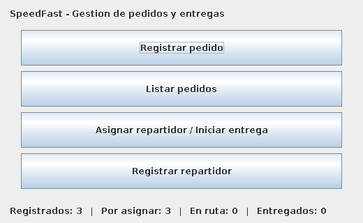
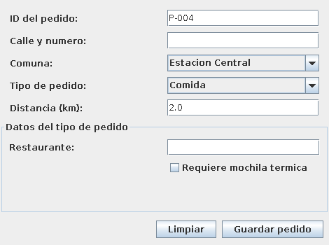
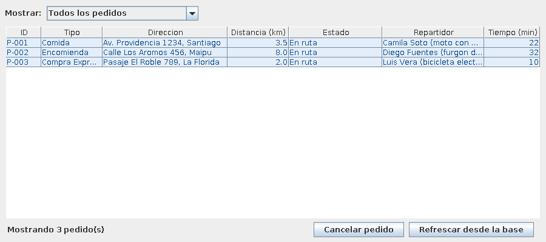
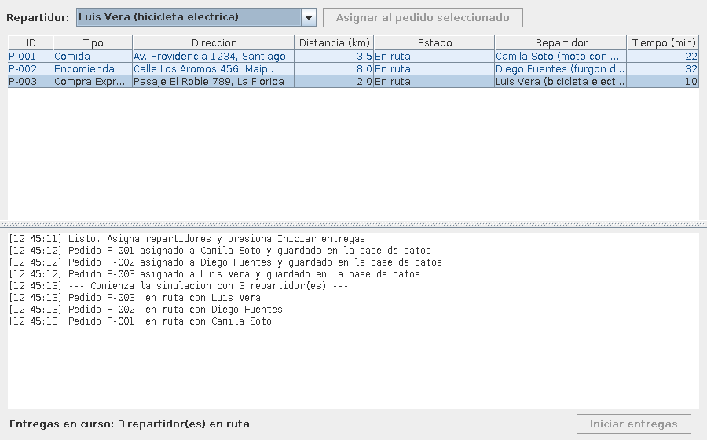

# SpeedFast — Persistencia con JDBC y MySQL

**Asignatura:** Desarrollo Orientado a Objetos II (PRY2203) — Duoc UC
**Experiencia 2 — Semana 7:** Conectando aplicaciones Java con bases de datos mediante JDBC

## Descripción

Séptima etapa del sistema de SpeedFast. Hasta la semana 6 los pedidos vivían en listas en memoria:
al cerrar la aplicación se perdía todo. Ahora se guardan en una **base de datos MySQL** a la que la
aplicación se conecta con **JDBC**.

Los formularios de la interfaz gráfica escriben directamente en la base, la tabla muestra lo que
hay guardado, y lo que ocurre durante la simulación de entregas —cambios de estado y entregas
completadas— también queda registrado.

## Cómo ponerlo en marcha

### 1. Crear la base de datos

Ejecutar el script `sql/speedfast_db.sql`, en MySQL Workbench o por consola:

```bash
mysql -u root -p < sql/speedfast_db.sql
```

Crea la base `speedfast_db`, las tres tablas con sus llaves foráneas y deja cargados los tres
repartidores de la empresa.

Una nota sobre el nombre: el script del enunciado hace `CREATE DATABASE speedfast` y a continuación
`USE speedfast_db`, dos nombres distintos, así que falla en la segunda línea. El Paso 1 pide
`speedfast_db`, y ese es el nombre que usa este script.

### 2. Agregar el conector JDBC al proyecto

El conector ya viene en `lib/mysql-connector-j-26.7.0.jar` y el módulo lo declara en su `.iml`,
así que al abrir la carpeta en IntelliJ queda listo sin configurar nada.

Si hiciera falta agregarlo a mano: `File → Project Structure → Libraries → + → Java…` y elegir ese
archivo, o `+ → From Maven…` buscando `com.mysql:mysql-connector-j`.

El conector solo hace falta **al ejecutar**: el código no importa ninguna clase de MySQL, solo las
interfaces de `java.sql`, así que compila sin él.

### 3. Indicar la contraseña

Copiar `src/db.properties.ejemplo` como `src/db.properties` y completarlo:

```properties
url=jdbc:mysql://localhost:3306/speedfast_db
usuario=root
clave=la_contraseña_de_tu_MySQL
```

Va dentro de `src/` a propósito: así queda en el *classpath* y `ConexionBD` lo encuentra sin
importar desde qué carpeta se ejecute la aplicación. Si estuviera en la raíz del módulo, IntelliJ
—que ejecuta desde la carpeta del proyecto— no lo vería y se conectaría sin contraseña.

`db.properties` está en el `.gitignore` a propósito: **una contraseña no se sube a un repositorio
público**. Por eso en el repositorio va el archivo de ejemplo y cada quien pone la suya. Si el
archivo no existe, `ConexionBD` usa los valores por defecto.

### 4. Ejecutar

Desde IntelliJ, ejecutar `com.speedfast.main.Main`. Si el servidor MySQL está apagado o la
contraseña no corresponde, la aplicación lo dice con un mensaje que incluye la dirección a la que
intentó conectarse, en lugar de caerse con un error incomprensible.

## Modelo de base de datos

```
repartidor                pedido                        entrega
----------                ------                        -------
id (PK)                   id (PK)                       id (PK)
nombre                    direccion                     id_pedido      -> pedido(id)
vehiculo *                tipo                          id_repartidor  -> repartidor(id)
                          estado                        fecha
                          codigo *                      hora
                          distancia_km *
                          restaurante *
                          peso_kg *
                          embalaje *
                          local_compra *
                          prioritario *
                          estado_detalle *
```

`entrega` es la tabla que relaciona las otras dos: un repartidor puede tener muchas entregas, y un
pedido puede tener más de una si se simulan varios intentos.

### Sobre las columnas marcadas con \*

Las columnas sin asterisco son exactamente las del modelo de la actividad. Las marcadas son
**agregadas**, y todas admiten `NULL`, así que el modelo original funciona igual aunque no se usen.

Se agregaron porque el formulario de la semana 6 ya pedía esos datos y, sin ellas, la mitad de lo
construido antes se perdía al guardar: un pedido volvería de la base sin distancia, sin restaurante
y sin su código visible.

Dos merecen explicación:

- **`codigo`** guarda el `P-001` que se ve en la tabla. Es distinto de `id`, que lo genera MySQL con
  `AUTO_INCREMENT`. Se mantienen los dos porque el identificador que la usuaria lee y escribe no
  tiene por qué ser el mismo que usa la base para relacionar tablas. Lleva `UNIQUE` para que no se
  repita.
- **`estado_detalle`** guarda el estado exacto del sistema. La columna `estado` acepta los valores
  del modelo (`PENDIENTE`, `EN_REPARTO`, `ENTREGADO`) y el sistema maneja cinco desde la semana 3,
  así que `PedidoDAO` los traduce: reservado y asignado son ambos "pendiente de salir". Para no
  perder el detalle, el estado exacto se guarda aparte. `CANCELADO` sí se agregó a `estado`, porque
  la interfaz tiene ese botón y agruparlo con otro habría sido mentir sobre lo que pasó.

### Restricciones

Además de las llaves primarias, las foráneas y los `NOT NULL` del modelo, el script define:

| Restricción | Qué impide |
|-------------|------------|
| `uq_pedido_codigo` | Dos pedidos con el mismo código visible |
| `ck_pedido_tipo` | Un tipo que no sea `COMIDA`, `ENCOMIENDA` o `EXPRESS` |
| `ck_pedido_estado` | Un estado fuera de los permitidos |
| `ck_pedido_distancia` | Una distancia negativa |

## Estructura del proyecto

```
semana 7/
├── sql/speedfast_db.sql             Script de la base de datos
├── lib/mysql-connector-j-*.jar      Conector JDBC de MySQL
├── docs/capturas/                   Capturas de las ventanas
├── src/
│   ├── db.properties.ejemplo        Plantilla de los datos de conexión
│   └── com/speedfast/
│       ├── main/Main.java               Punto de entrada; comprueba la conexión
│   ├── dao/                         Acceso a la base de datos
│   │   ├── ConexionBD.java          Entrega las conexiones con DriverManager
│   │   ├── PedidoDAO.java           guardar, listarTodos, actualizarEstado
│   │   ├── RepartidorDAO.java       listarTodos, guardar
│   │   └── EntregaDAO.java          guardar, listarTodas
│   ├── control/
│   │   └── ControladorDePedidos.java    Coordina la interfaz con los DAO
│   ├── modelo/                      Reutilizado de las semanas 2 a 6
│   │   ├── Pedido.java              Clase abstracta
│   │   ├── PedidoComida.java
│   │   ├── PedidoEncomienda.java
│   │   ├── PedidoExpress.java
│   │   ├── Entrega.java             Nueva: corresponde a la tabla entrega
│   │   ├── EstadoPedido.java
│   │   ├── Comuna.java
│   │   └── Repartidor.java
│   ├── vista/                       Las ventanas de la semana 6, ya conectadas
│   │   ├── VentanaPrincipal.java
│   │   ├── VentanaRegistroPedido.java
│   │   ├── VentanaRegistroRepartidor.java   Nueva
│   │   ├── VentanaListaPedidos.java
│   │   ├── VentanaEntregas.java
│   │   ├── ModeloTablaPedidos.java
│   │   └── RenderEstadoPedido.java
│   └── contrato/                    Interfaces del sistema
└── test/com/speedfast/              Pruebas unitarias
```

## Las clases de acceso a datos

### `ConexionBD`

Es el único lugar donde se abre una conexión. Lee la dirección, el usuario y la contraseña de
`db.properties` y los entrega a `DriverManager.getConnection(...)`.

Tiene además `comprobarConexion()`, que `Main` llama al arrancar para avisar del problema **antes**
de abrir las ventanas, en lugar de dejar que falle el primer formulario.

### Los tres DAO

| Clase | Métodos |
|-------|---------|
| `PedidoDAO` | `guardar(Pedido)` con `PreparedStatement`; `listarTodos()` que arma la lista recorriendo el `ResultSet`; `actualizarEstado(Pedido)` |
| `RepartidorDAO` | `listarTodos()` que devuelve `List<Repartidor>` leyendo del `ResultSet`; `guardar(Repartidor)` |
| `EntregaDAO` | `guardar(Entrega)`, que registra la relación entre pedido y repartidor; `listarTodas()` |

Tres cosas que hacen todos igual:

- **`PreparedStatement` siempre, nunca concatenar texto en la consulta.** Cada dato va en su
  parámetro (`sentencia.setString(1, ...)`), así que lo que escriba la usuaria en el formulario no
  puede cambiar lo que hace la consulta. Es lo que evita la inyección SQL.
- **`Statement.RETURN_GENERATED_KEYS`** para recuperar el `id` que generó MySQL y dejarlo en el
  objeto. Sin eso, un pedido recién guardado no sabría su propio id y no se le podría asociar una
  entrega.
- **`try-with-resources`** para cerrar la conexión, la sentencia y el `ResultSet`.

### Sobre `try-with-resources` en lugar de `finally`

La actividad pide cerrar los recursos con `try-catch-finally`. Aquí se usa `try-with-resources`,
que es la forma que Java recomienda desde la versión 7 para exactamente lo mismo: el compilador lo
convierte en un `try-finally` con los `close()` dentro, y además los cierra en orden inverso y
maneja el caso en que el propio `close()` falle, que escrito a mano es fácil de equivocar.

```java
try (Connection conexion = ConexionBD.conectar();
     PreparedStatement sentencia = conexion.prepareStatement(SQL_LISTAR);
     ResultSet filas = sentencia.executeQuery()) {
    ...
}   // aqui se cierran los tres, aunque se haya lanzado una excepcion
```

### Dónde se atrapan las excepciones

Los DAO **no** atrapan `SQLException`: la declaran y la dejan subir. El `catch` está en las
ventanas, que es donde hay algo que hacer con el error — mostrarle a la usuaria qué falló, con un
`JOptionPane` que dice qué se intentaba y qué respondió MySQL.

Atraparla dentro del DAO obligaría a devolver algo falso: una lista vacía como si no hubiera
pedidos, o un `false` que no distingue "no se pudo guardar" de "se guardó". La interfaz mostraría
una tabla vacía sin que nadie se entere de que la base está caída. Por eso el error viaja hasta
quien puede reaccionar.

`Main` es la excepción: ahí el `catch` está al inicio, para avisar de que no hay base de datos
antes de abrir ninguna ventana.

### Cómo se traducen los objetos a filas

`PedidoDAO` es el que sabe traducir en los dos sentidos:

- **Al guardar**, la subclase decide el valor de `tipo`: un `PedidoComida` se guarda como `COMIDA`.
- **Al leer**, la columna `tipo` decide qué subclase construir. Por eso un pedido que se guardó como
  encomienda vuelve como `PedidoEncomienda`, con su peso y su embalaje, y sigue calculando su tiempo
  de entrega con su propia fórmula.

Ese ida y vuelta es lo que comprueban varias de las pruebas: no basta con que el `INSERT` no falle,
el pedido tiene que volver siendo el mismo.

## La interfaz, ahora contra la base

| Ventana | Qué cambió |
|---------|-----------|
| `VentanaRegistroPedido` | Al guardar hace `INSERT` en `pedido` y muestra el id que asignó MySQL. Si la base rechaza el dato, avisa y el pedido no queda en pantalla |
| `VentanaRegistroRepartidor` | **Nueva.** Registra repartidores en la tabla `repartidor`; quedan disponibles de inmediato en el combo de entregas |
| `VentanaListaPedidos` | La tabla se llena con lo que hay en la base. El botón *Refrescar desde la base* vuelve a consultar, así se ven los cambios hechos desde Workbench |
| `VentanaEntregas` | Asignar guarda el cambio de estado. Durante la simulación, cada cambio se guarda y cada pedido entregado agrega una fila en `entrega` |

### El orden importa: primero la base, después la pantalla

`ControladorDePedidos.agregarPedido()` guarda en MySQL **antes** de agregar el pedido a la lista en
memoria. Si el `INSERT` falla, el pedido no aparece en la tabla. Al revés, la interfaz mostraría un
pedido que en realidad no se guardó, y bastaría cerrar la aplicación para que desapareciera.

### Las consultas no se hacen en el hilo gráfico

Los repartidores siguen siendo hilos. Cuando uno avisa que entregó un pedido, `VentanaEntregas`
guarda el cambio en la base **en ese mismo hilo**, y recién después manda a actualizar la pantalla
con `SwingUtilities.invokeLater(...)`. Si la consulta se hiciera dentro del hilo gráfico, la ventana
se congelaría mientras dura.

## Pruebas unitarias

**53 pruebas** en cinco archivos, con JUnit 5:

| Archivo | Qué comprueba |
|---------|---------------|
| `PedidoDAOTest` | Que guardar asigne el id generado; que un pedido vuelva de la base con su subclase y sus datos; que la base rechace un código repetido; que un pedido asignado o en ruta vuelva **reasignable** y no bloqueado; que un pedido entregado no se pueda cancelar |
| `RepartidorDAOTest` | Que `listarTodos()` traiga los repartidores con su id y vehículo, ordenados; que guardar asigne el id; que se rechace un nombre vacío |
| `EntregaDAOTest` | Que la entrega se guarde y se lea con su fecha y hora; que un pedido pueda tener varias; que **las llaves foráneas rechacen** una entrega de un pedido o un repartidor que no existen |
| `ControladorDePedidosTest` | Que lo registrado quede guardado de verdad: varias pruebas vuelven a leer desde la base con un controlador nuevo antes de revisar el resultado |
| `ModeloTablaPedidosTest` | El modelo de la tabla, sin base de datos de por medio |

Las pruebas que necesitan MySQL usan `Assumptions.assumeTrue(...)`: si el servidor no está
encendido **se omiten en vez de fallar**, porque un servidor apagado no es un error del código. Las
de `ModeloTablaPedidos` corren siempre.

Para ejecutarlas desde IntelliJ: clic derecho sobre la carpeta `test` → *Run All Tests*. La
primera vez IntelliJ ofrece descargar JUnit 5; hay que aceptarlo, porque a diferencia del conector
de MySQL la librería de pruebas no viaja en `lib/`.

## Capturas

**Ventana principal**



**Registro de pedido** — al guardar, el pedido se escribe en la tabla `pedido`



**Listado de pedidos** — la tabla muestra lo que hay en la base de datos



**Entregas en curso** — cada cambio de estado se guarda mientras corre la simulación



## Decisiones de diseño

- **Un paquete `dao` aparte.** El acceso a la base no está ni en el modelo ni en las ventanas. Si
  mañana se cambiara MySQL por otra base, solo cambian esas cuatro clases.
- **El modelo no sabe que existe una base de datos.** `Pedido` y `Repartidor` no importan nada de
  `java.sql`. Lo único que se les agregó es un campo `id`, que es el número con el que la base los
  identifica.
- **La contraseña fuera del código.** Está en `db.properties`, que no se sube al repositorio. Quien
  ejecute el proyecto en otro computador cambia ese archivo y no recompila nada.
- **Las listas en memoria siguen existiendo, pero como copia.** La interfaz no consulta la base cada
  vez que dibuja una fila; consulta al cargar y cuando algo cambia. Es lo que mantiene la tabla
  rápida sin dejar de reflejar lo guardado.
- **La asignación de repartidor no se guarda, y es a propósito.** En el modelo, pedido y repartidor
  se relacionan **solo** a través de `entrega`. Mientras no haya entrega no hay nada que guardar, así
  que un pedido que quedó asignado al cerrar la aplicación vuelve como pendiente y se puede asignar
  de nuevo. La alternativa —recordar el estado `ASIGNADO` sin recordar a quién— dejaba el pedido
  bloqueado: no se podía reasignar, porque ya no estaba pendiente, ni despachar, porque no tenía
  repartidor.
- **Un pedido entregado no se puede cancelar.** Antes de esta semana esa regla faltaba y solo
  producía una incoherencia en pantalla. Ahora dejaría la base diciendo dos cosas a la vez: una fila
  en `entrega` que prueba que se entregó, y el pedido marcado como cancelado.
- **Los errores de base de datos se muestran, no se esconden.** Cada `SQLException` termina en un
  `JOptionPane` que dice qué se intentaba hacer y qué respondió MySQL.

## Entorno

- IntelliJ IDEA
- Java 17
- MySQL 8 o superior
- MySQL Connector/J (JDBC)
- Java Swing (incluido en el JDK)

---

**Autora:** Olga Rivas
